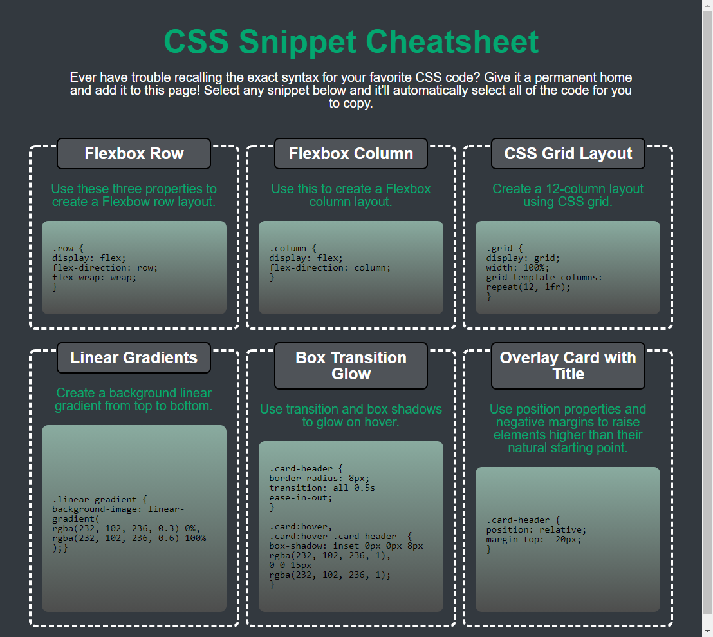

# CSS cheatsheet

## Mini Project #1
This cheatsheet can be easily adapted as one comes across new exciting CSS code.  The syntax will be easily referenced at a later date.  The layout and content was copied from the image shown below the screenshot of this site that has been deployed at [kellyjohnson364.github.io/css-cheatshit](https://kellyjohnson364.github.io/css-cheatsheet/)

## Screenshot of this page

## Screenshot of project reference page

